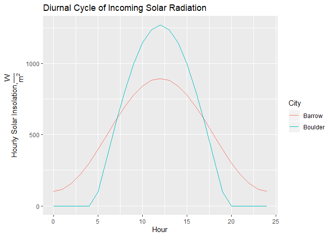

R Markdown Example
================
Sean Horvath
01 February, 2020

See appendix for source code.

**Problem 1**  
**a)** Code Output:

    ## [1] 1322.257 1414.052

    ## [1] 0.967269 1.034420

The range of the effective solar constant is 1322-1414
\(\frac{W}{m^{2}}\)  
Or as a percentage of the true solar constant: 0.97%-1.03%

**b)** Code Output:

    ## [1] "Maximum: January 03"

    ## [1] "Minimum: July 04"

The dates that maximum and minimum occur are January 3 and July 4,
repectively.

**Problem 2**  
Values in Degrees

|                     |  Dec. 21 |   Feb. 5 |  Mar. 21 | June 21 |
| ------------------- | -------: | -------: | -------: | ------: |
| Honolulu, HI (21 N) | 44.49931 | 37.38514 | 21.33713 |     2.5 |
| Boulder, CO (40 N)  | 63.49931 | 56.38514 | 40.33713 |    16.5 |
| Oslo, Norway (60 N) | 83.49931 | 76.38514 | 60.33713 |    36.5 |
| Barrow, AK (71 N)   | 94.49931 | 87.38514 | 71.33713 |    47.5 |

**Problem 3**  
Values in \(\frac{W}{m^{2}}\)

|                     |    Dec. 21 |    Feb. 5 |   Mar. 21 |   June 21 |
| ------------------- | ---------: | --------: | --------: | --------: |
| Honolulu, HI (21 N) |  1007.7861 | 1117.4150 | 1283.4361 | 1322.1040 |
| Boulder, CO (40 N)  |   630.4622 |  778.5440 | 1050.2893 | 1268.8671 |
| Oslo, Norway (60 N) |   159.9652 |  331.0372 |  681.9078 | 1063.7949 |
| Barrow, AK (71 N)   | \-110.8405 |   64.1587 |  440.9210 |  894.0515 |

**Problem 4**  
Day length in hours.  
Daily averaged solar insolation in
\(\frac{W}{m^{2}}\)

|                                     |    Dec. 21 |     Feb. 5 |   Mar. 21 |   June 21 |
| ----------------------------------- | ---------: | ---------: | --------: | --------: |
| Honolulu, HI (21 N) day length      |  10.718957 |  11.135902 |  11.98274 |  13.28109 |
| Honolulu, HI (21 N) daily avg solar | 289.394424 | 332.311254 | 407.88202 | 460.09587 |
| Boulder, CO (40 N) day length       |   9.146977 |  10.095501 |  11.96228 |  14.85312 |
| Boulder, CO (40 N) daily avg solar  | 156.109754 | 211.489137 | 333.27540 | 485.30024 |
| Oslo, Norway (60 N) day length      |   5.485471 |   7.917862 |  11.92214 |  18.51482 |
| Oslo, Norway (60 N) daily avg solar |  24.153998 |  71.431833 | 215.72941 | 479.47611 |
| Barrow, AK (71 N) day length        |   0.000000 |   4.180992 |  11.86944 |  24.00000 |
| Barrow, AK (71 N) daily avg solar   |   0.000000 |   7.411498 | 138.93615 | 498.79207 |

**Problem 5**  
<!-- -->

Latitude is the culprit here, driving the differences in diurnal cycles
of these two locations. Because the latitude of Barrow is above
66.5\(^\circ\) it experiences 24-hours of sunlight during parts of the
summer (such as on June 21). This is why the radiation flux never drops
to 0. Boulder on the other hand still experiences night, so there are
times in the early morning and late night when the radiation flux
becomes 0.

The intensity of radiation is greater at noon in Boulder because of
latitude as well. On June 21 the sun is directly overhead at noon at
23.5\(^\circ\) north. Because Boulder’s latitude is closer to that than
Barrow, radiation from the sun is coming in at less of an angle,
resulting in the higher flux. Finally, the slope of radiation flux is
smaller for Barrow because the angle of the sun doesn’t change as much
throughout the day compared to
Boulder.

#### Code Appendix

``` r
## ----echo=FALSE----------------------------------------------------------
knitr::opts_chunk$set(echo=FALSE, warning=FALSE)

## ----message=FALSE-------------------------------------------------------
# Load libraries:
library(knitr);library(reshape2);library(dplyr);library(ggplot2)
# Create function to calculate all TOA variables:
toa_radiation <- function(year,month,day,hour,lat){
  return_dataframe <- data.frame(declination=NA,
  Z=NA,
  Hs=NA,
  r=NA,
  Seff=NA,
  I_day=NA,
  I=NA)
  # Declination
  day_of_interest <- as.Date(paste0(year,'-',month,'-',day))
  reference_day <- as.Date(paste0(year,'-06-21'))
  n <- day_of_interest-reference_day
  if(n<0){
  reference_day <- as.Date(paste0(year-1,'-06-21'))
  n <- day_of_interest-reference_day
  }
  return_dataframe$declination <- 23.5*cos(0.986*as.numeric(n)*pi/180)
  # Z
  lat <- lat*pi/180
  return_dataframe$Z <- acos(sin(lat)*sin(return_dataframe$declination*pi/180)+cos(lat)*cos(return_dataframe$declination*pi/180)*cos((15*(hour-12))*pi/180))*180/pi
  # Hs
  temp <- -tan(lat)*tan(return_dataframe$declination*pi/180)
  if(temp>1){
    temp=1
  } else if(temp<(-1)){
      temp=-1
  }
  Hs_value <- acos(temp)*180/pi
  return_dataframe$Hs <- Hs_value
  # r
  day_of_interest <- as.Date(paste0(year,'-',month,'-',day))
  reference_day <- as.Date(paste0(year,'-07-04'))
  n <- day_of_interest-reference_day
  if(n<0){
  reference_day <- as.Date(paste0(year-1,'-07-04'))
  n <- day_of_interest-reference_day
  }
  r_value <- 149*10^6+2.5*10^6*cos(0.986*as.numeric(n)*pi/180)
  return_dataframe$r <- r_value
  # Seff
  return_dataframe$Seff <- (149*10^6/return_dataframe$r)^2*1367
  # I_day
  return_dataframe$I_day <- 435*(149*10^6/return_dataframe$r)^2*(return_dataframe$Hs*pi/180*sin(lat)*sin(return_dataframe$declination*pi/180)+cos(lat)*cos(return_dataframe$declination*pi/180)*sin(return_dataframe$Hs*pi/180))
  # I
  return_dataframe$I <- 1367*(149000000/return_dataframe$r)^2*cos(return_dataframe$Z*pi/180)
  return(return_dataframe)
}


## ------------------------------------------------------------------------
# Problem 1a)
doy <- data.frame(month=c(rep(1,31),rep(2,28),rep(3,31),rep(4,30),
                            rep(5,31),rep(6,30),rep(7,31),rep(8,31),
                            rep(9,30),rep(10,31),rep(11,30),rep(12,31)),
                    day=c(seq(1,31),seq(1,28),seq(1,31),seq(1,30),
                          seq(1,31),seq(1,30),seq(1,31),seq(1,31),
                          seq(1,30),seq(1,31),seq(1,30),seq(1,31)),
                    Seff=rep(NA,365))
  for(i in 1:dim(doy)[1]){
    doy$Seff[i] <- toa_radiation(2001,doy$month[i],doy$day[i],12,40)$Seff
  }
  print(range(doy$Seff))
  print(range(doy$Seff)/1367)


## ------------------------------------------------------------------------
# Problem 1b)
print(paste0('Maximum: ',format(as.Date(paste0('2001-',
                                             doy$month[which.max(doy$Seff)],'-',
                                               doy$day[which.max(doy$Seff)])),
                                "%B %d")))
print(paste0('Minimum: ',format(as.Date(paste0('2001-',
                                               doy$month[which.min(doy$Seff)],
                                            '-',doy$day[which.min(doy$Seff)])),
                                "%B %d"))) 


## ------------------------------------------------------------------------
# Problem 2)
Z_dates <- c('12-21','02-05','03-21','06-21')
Z_lats <- c(21,40,60,71)
Z_df <- expand.grid(date=Z_dates,lat=Z_lats)

for(i in 1:dim(Z_df)[1]){
  Zmonth <- as.numeric(substr(Z_df$date[i],1,2))
  Zday <- as.numeric(substr(Z_df$date[i],4,5))
  Zlat <- Z_df$lat[i]
  Z_df$Z[i] <- toa_radiation(2018,Zmonth,Zday,12,Zlat)$Z
}
Z_df <- dcast(Z_df,lat~date,value.var='Z')
Z_df <- Z_df[,-1]
rownames(Z_df) <- c('Honolulu, HI (21 N)',
                    'Boulder, CO (40 N)',
                    'Oslo, Norway (60 N)',
                    'Barrow, AK (71 N)')
colnames(Z_df) <- c('Dec. 21','Feb. 5','Mar. 21','June 21')
knitr::kable(Z_df)


## ------------------------------------------------------------------------
# Problem 3)
I_dates <- c('12-21','02-05','03-21','06-21')
I_lats <- c(21,40,60,71)
I_df <- expand.grid(date=I_dates,lat=I_lats)

for(i in 1:dim(I_df)[1]){
  Imonth <- as.numeric(substr(I_df$date[i],1,2))
  Iday <- as.numeric(substr(I_df$date[i],4,5))
  Ilat <- I_df$lat[i]
  I_df$I[i] <- toa_radiation(2018,Imonth,Iday,12,Ilat)$I
}
I_df <- dcast(I_df,lat~date,value.var='I')
I_df <- I_df[,-1]
rownames(I_df) <- c('Honolulu, HI (21 N)',
                    'Boulder, CO (40 N)',
                    'Oslo, Norway (60 N)',
                    'Barrow, AK (71 N)')
colnames(I_df) <- c('Dec. 21','Feb. 5','Mar. 21','June 21')
kable(I_df)


## ------------------------------------------------------------------------
# Problem 4)
I_dates <- c('12-21','02-05','03-21','06-21')
I_lats <- c(21,40,60,71)
I_df <- expand.grid(date=I_dates,lat=I_lats)

for(i in 1:dim(I_df)[1]){
  Imonth <- as.numeric(substr(I_df$date[i],1,2))
  Iday <- as.numeric(substr(I_df$date[i],4,5))
  Ilat <- I_df$lat[i]
  I_df$Hs[i] <- toa_radiation(2002,Imonth,Iday,12,Ilat)$Hs
  I_df$I_day[i] <- toa_radiation(2002,Imonth,Iday,12,Ilat)$I_day
}

I_df$Hs <- I_df$Hs*2/15

Hs_df <- dcast(I_df,lat~date,value.var='Hs')
colnames(Hs_df) <- c('lat','Dec. 21','Feb. 5','Mar. 21','June 21')

Iday_df <- dcast(I_df,lat~date,value.var='I_day')
colnames(Iday_df) <- c('lat','Dec. 21','Feb. 5','Mar. 21','June 21')

combined_df <- bind_rows(Hs_df,Iday_df) %>%
  arrange(lat)
combined_df <- combined_df[,-1]
rownames(combined_df) <- c('Honolulu, HI (21 N) day length',
                           'Honolulu, HI (21 N) daily avg solar',
                           'Boulder, CO (40 N) day length',
                           'Boulder, CO (40 N) daily avg solar',
                           'Oslo, Norway (60 N) day length',
                           'Oslo, Norway (60 N) daily avg solar',
                           'Barrow, AK (71 N) day length',
                           'Barrow, AK (71 N) daily avg solar')
kable(combined_df)


## ------------------------------------------------------------------------
# Problem 5)
diurnal_I <- data.frame(Hour=rep(seq(0,24),2),
                        Insolation=rep(NA,50),
                        City=rep(c('Boulder','Barrow'),each=25))
for(i in 1:dim(I_df)[1]){
  for(j in 1:25){
    diurnal_I$Insolation[j] <- toa_radiation(2002,6,21,
                                            diurnal_I$Hour[j],40)$I
    diurnal_I$Insolation[j+25] <- toa_radiation(2002,6,21,
                                            diurnal_I$Hour[j],71)$I
  }
}
diurnal_I$Insolation[which(diurnal_I$Insolation<0)] <- 0

ggplot(diurnal_I,aes(x=Hour,y=Insolation,color=City)) +
  geom_line(aes(group=City)) +
  ylab(expression(paste('Hourly Solar Insolation, ',over(W,m^2)))) +
  ggtitle('Diurnal Cycle of Incoming Solar Radiation')


## ----code = readLines(knitr::purl("C:/Users/seanm/Desktop/R-Tutorial/Notebook Example.Rmd", documentation = 1)), echo = T, eval = F----
## NA
```
